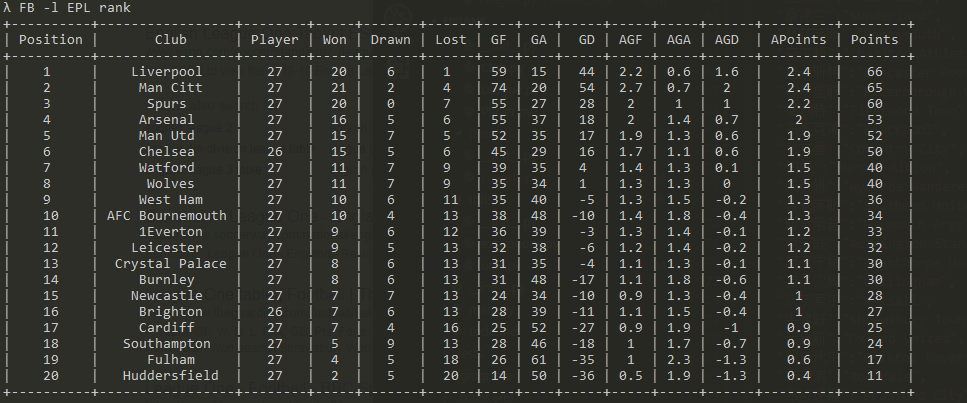

# FBRank


[](https://badge.fury.io/py/FBRank)

#### What Is It ?

FBRank is an terminal tool which can help you review football information

#### Usage

```
$ FB -h

usage: FB [-h] [-l LEAGUE] {rank,info,news}

load football list

positional arguments:
  {rank,info,news}

optional arguments:
  -h, --help            show this help message and exit
  -l LEAGUE, --league LEAGUE

```

```

$ FB -l 英超 rank # it only support Chinese keywords now 

+------+----------+------+----+----+----+------+------+--------+----------+----------+----------+----------+------+
| 排名 |  球队名  | 场次 | 胜 | 平 | 负 | 进球 | 失球 | 净胜球 | 场均进球 | 场均失球 | 场均净胜 | 场均积分 | 积分 |
+------+----------+------+----+----+----+------+------+--------+----------+----------+----------+----------+------+
|  1   |  切尔西  |  18  | 15 | 1  | 2  |  38  |  11  |   27   |   2.1    |   0.6    |   1.5    |   2.6    |  46  |
|  2   |  利物浦  |  18  | 12 | 4  | 2  |  45  |  21  |   24   |   2.5    |   1.2    |   1.3    |   2.2    |  40  |
....
....
....
|  20  |  斯旺西  |  18  | 3  | 3  | 12 |  21  |  41  |  -20   |   1.2    |   2.3    |   -1.1   |   0.7    |  12  |
+------+----------+------+----+----+----+------+------+--------+----------+----------+----------+----------+------+

```


#### Get it

- The First Way is to build it from source,you can get the newest feature  `python setup.py install`

- or you can get the stable version from **pypi**

```
pip install FBRank

```

#### To Do

- [x] Show rank and news
- [ ] Assign the certain rank to get more specific club info
- [ ] Add color support,top 4/top 6/end 3
- [ ] Add club and player info
- [x] Add tox.ini(done) 
- [ ] Add coverage report

---


