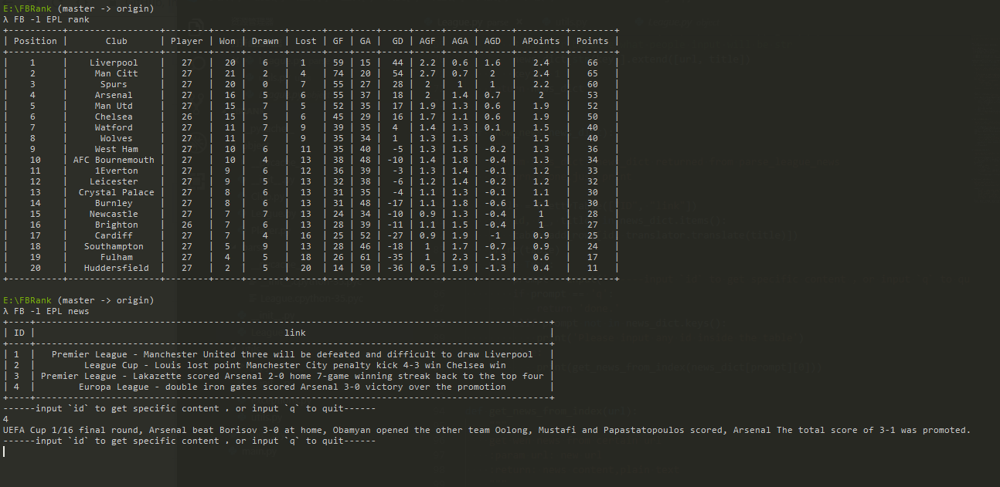

# FBRank


[](https://badge.fury.io/py/FBRank)

#### What Is It ?

FBRank is a terminal tool which can help you review football information

#### Usage

```
$ FB -h

usage: FB [-h] [-l LEAGUE] {rank,info,news}

load football list

positional arguments:
  {rank,info,news}

optional arguments:
  -h, --help            show this help message and exit
  -l LEAGUE, --league LEAGUE

```

```

$ FB -l EPL rank # 

+----------+-----------------+--------+-----+-------+------+----+----+-----+-----+-----+------+---------+--------+
| Position |       Club      | Player | Won | Drawn | Lost | GF | GA |  GD | AGF | AGA | AGD  | APoints | Points |
+----------+-----------------+--------+-----+-------+------+----+----+-----+-----+-----+------+---------+--------+
|    1     |    Liverpool    |   27   |  20 |   6   |  1   | 59 | 15 |  44 | 2.2 | 0.6 | 1.6  |   2.4   |   66   |
|    2     |     Man City    |   27   |  21 |   2   |  4   | 74 | 20 |  54 | 2.7 | 0.7 |  2   |   2.4   |   65   |
...
...
...
|    20    |   Huddersfield  |   27   |  2  |   5   |  20  | 14 | 50 | -36 | 0.5 | 1.9 | -1.3 |   0.4   |   11   |
+----------+-----------------+--------+-----+-------+------+----+----+-----+-----+-----+------+---------+--------+

```


#### Get it

- The First Way is to build it from source,you can get the newest feature  `python setup.py install`

- or you can get the stable version from `pip install FBRank`

- In case you cannot run the application , you still need to `pip install translation`


#### To Do

- [x] Show rank and news
- [ ] Assign the certain rank to get more specific club info
- [ ] Add color support,top 4/top 6/end 3
- [ ] Add club and player info
- [x] Add tox.ini(done) 
- [ ] Add coverage report

---


